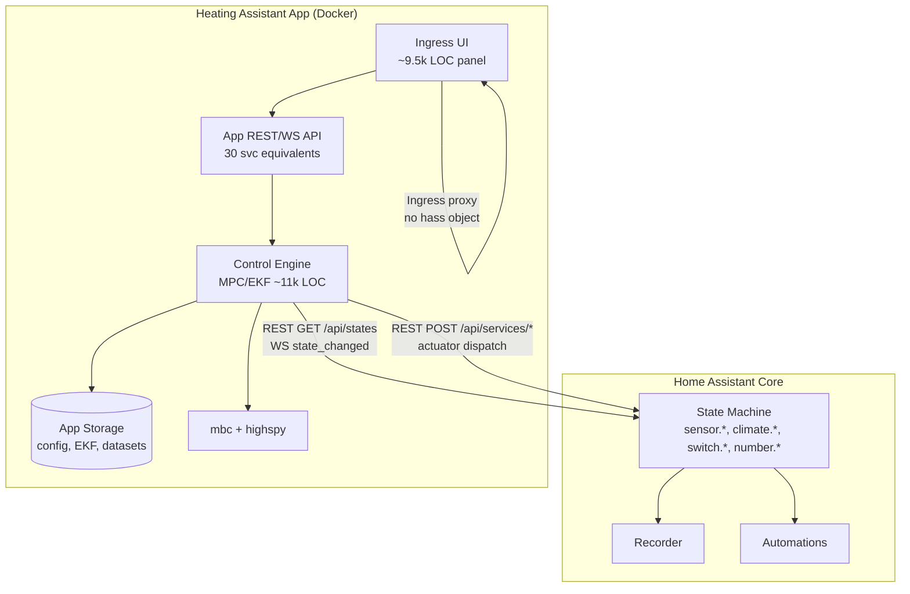
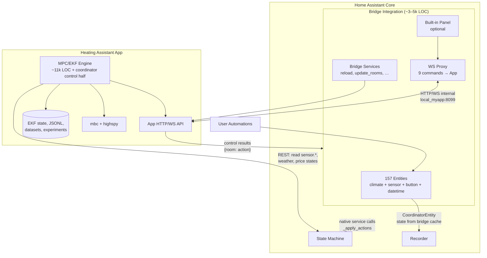
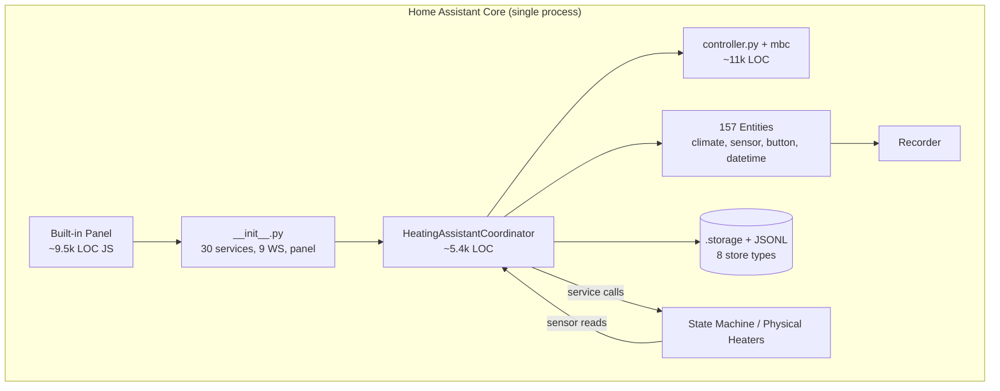
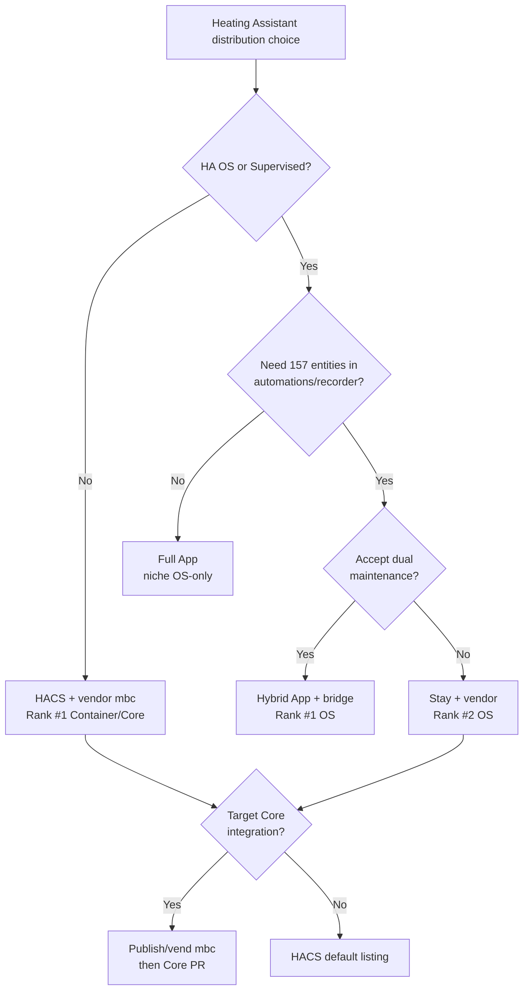
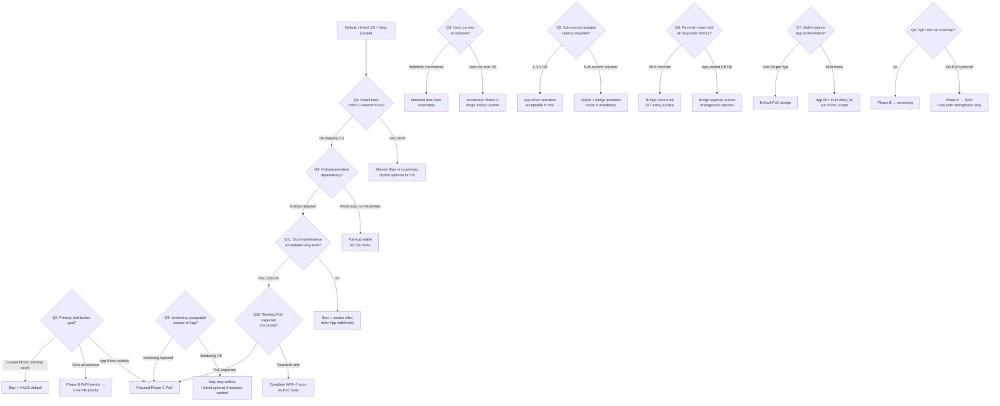
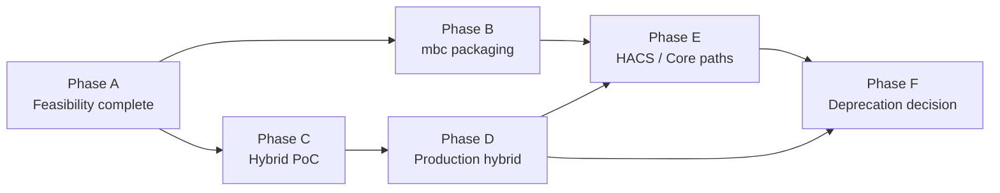
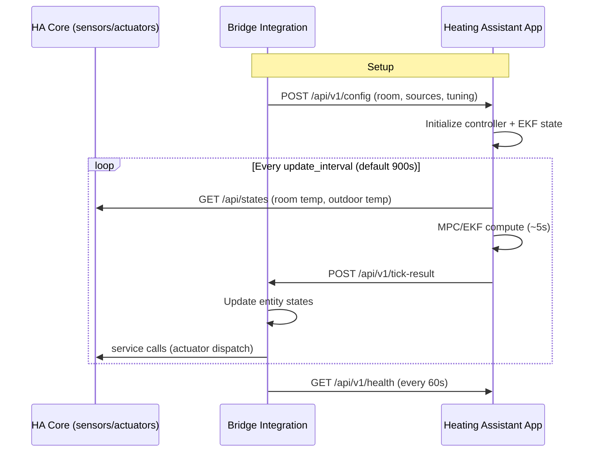

# Heating Assistant → Home Assistant App: Progress Report

> **Work packages covered:** WP1–WP7 (complete)  
> **Date:** 2026-06-24  
> **Status:** Feasibility phase complete — see `STATUS.md` for executive summary and next actions

---

## WP1: Terminology & Distribution Landscape

### 1. What "Home Assistant Apps" are (formerly add-ons)

Home Assistant **Apps** are the renamed term for what was previously called **add-ons** (rename surfaced in HA 2026.6; developer docs and UI now use "Apps"). They are **standalone containerized applications** managed by the **Supervisor**, running **alongside** Home Assistant Core on the same host — not inside Core's Python process.

Key characteristics ([developers.home-assistant.io/docs/apps/](https://developers.home-assistant.io/docs/apps/)):

| Aspect | Detail |
|--------|--------|
| Runtime | Docker container image (published to GHCR, Docker Hub, etc.) |
| Management | Supervisor panel → Apps page (install, start/stop, configure) |
| Purpose | Extend the *system* HA runs on — MQTT brokers, VPNs, code editors, media servers, or any sidecar service |
| Config | Per-app `config.yaml` (name, version, slug, description, architectures, options schema) |
| Build | Dockerfile is source of truth; multi-arch publishing via GitHub Actions composite builder actions ([publishing docs](https://developers.home-assistant.io/docs/apps/publishing/)) |

Apps are **not** part of Home Assistant Core. They do not register entities, services, or config flows in Core unless they also ship (or pair with) an integration.

### 2. Apps vs Integrations vs custom panels

| Dimension | **Integration** | **App** | **Custom panel** |
|-----------|-----------------|---------|------------------|
| Runs where | Inside HA Core (Python, event loop) | Separate Docker container (Supervisor-managed) | Inside HA frontend (browser JS) |
| Primary role | Connect devices/services *into* HA — entities, automations, services | Run software *next to* HA — often a server or standalone tool | Sidebar UI page with live `hass` object access |
| Entity registry | Yes — creates `climate.*`, `sensor.*`, etc. | No (unless paired with integration or uses REST to control existing entities) | No — UI only |
| Distribution | HACS, custom_components, Core PR | App repository URL → Supervisor store | Bundled in integration `www/` or `config/www/` + `panel_custom` / `async_register_built_in_panel` |
| Platform requirement | Any install type (Core, Container, OS) | **HA OS or Supervised only** (needs Supervisor) | Any install with frontend |
| Typical pattern | Client to external system | Server/container providing a capability | Dashboard / control UI |

**Heating Assistant today** is primarily an **integration** (platforms, coordinator, services) with a **custom built-in panel** (`async_register_built_in_panel` in `__init__.py` lines 1220–1243). It is not an App.

Mental model (from HA nomenclature shift): *integrate* devices into HA; *run apps* alongside HA; *panels* are frontend pages.

### 3. App distribution: official store, third-party repos, submission requirements

There is no separate mobile-style "App Store approval" pipeline. Distribution is **repository-based**:

#### Official / Core Apps
- Maintained in [github.com/home-assistant/addons](https://github.com/home-assistant/addons) ("Home Assistant Core Apps")
- Pre-installed catalog on HA OS — MQTT, Samba, SSH, etc.
- Inclusion requires PR + review to that repository

#### Third-party / community Apps
- Developer hosts a Git repo with:
  - **`repository.yaml`** at root (required `name`; optional `url`, `maintainer`) — [repository docs](https://developers.home-assistant.io/docs/apps/repository/)
  - One folder per app, each with **`config.yaml`**, **`Dockerfile`**, build metadata
- User adds repo URL in **Supervisor → App store → Repositories**
- Multiple apps per repository supported

#### Publishing model ([publishing docs](https://developers.home-assistant.io/docs/apps/publishing/))

| Method | UX | Developer responsibility |
|--------|-----|-------------------------|
| **Pre-built containers** (preferred) | Fast install — pull image | Build multi-arch images (amd64, aarch64, …), push to registry; set `image: ghcr.io/org/app` in `config.yaml` |
| **Locally built containers** | Slow, SD wear, higher failure rate | Source-only; Supervisor builds on device — OK for experiments, discouraged for production |

Submission requirements (practical checklist):
- Valid `config.yaml` (slug, version, description, arch list, image or build config)
- Dockerfile using HA base images recommended
- Multi-arch CI via [home-assistant/builder](https://github.com/home-assistant/builder) composite actions
- Optional: `ingress: true` for embedded UI; `homeassistant_api: true` for Core API access
- `repository.yaml` for third-party store listing
- Documentation (`DOCS.md`, `README.md`, translations) per example app repo conventions

Future note from publishing docs: locally built apps will be **marked/warned** in the store.

### 4. App ↔ HA Core communication

Documented in [App communication](https://developers.home-assistant.io/docs/apps/communication/):

#### REST API (via Supervisor proxy)
- URL: `http://supervisor/core/api/`
- Enable: `homeassistant_api: true` in app `config.yaml`
- Auth: `SUPERVISOR_TOKEN` env var as `Authorization: Bearer` token
- Same endpoints as standard [REST API](https://developers.home-assistant.io/docs/api/rest/) — states, services, config

#### WebSocket API (via Supervisor proxy)
- URL: `ws://supervisor/core/websocket`
- Password: `SUPERVISOR_TOKEN`
- Full HA WebSocket protocol (state subscriptions, service calls, history, etc.)

#### Supervisor API
- URL: `http://supervisor/` with Bearer token
- Requires `hassio_api: true` (and possibly `hassio_role: default`)
- Some paths available without full API flag: `/core/api`, `/core/websocket`, `/addons/self/*`, `/services*`, `/discovery*`, `/info`

#### Ingress UI
- Set `ingress: true` in `config.yaml`; app server on port **8099** (or `ingress_port`)
- HA proxies authenticated web UI into sidebar — no port forwarding
- Restrict incoming connections to `172.30.32.2` ([presentation docs](https://developers.home-assistant.io/docs/apps/presentation/))
- Supports HTTP/1.x, streaming, WebSockets through gateway

#### Inter-app networking
- Internal DNS: `{repo}_{slug}` (e.g. `local_myapp`); hostname uses `-` instead of `_`

### 5. Dependency bundling

**Apps can bundle any pip (or other) dependencies inside the Docker image.** There is no PyPI publication requirement, no HA Core `manifest.json` constraints, and no restriction that dependencies be installable at Core setup time. This directly addresses the **`mbc` GitHub zip** blocker noted in `PLAN.md` for Core integration acceptance.

Build example: `RUN pip install numpy scipy highspy git+https://github.com/.../mbc.git` in Dockerfile.

### 6. Platform limitation: HA OS / Supervised only

| Install type | Supervisor | Apps available? | Alternative |
|--------------|------------|-------------------|-------------|
| **Home Assistant OS** | Yes | Yes — native | — |
| **Home Assistant Supervised** | Yes | Yes | — |
| **Home Assistant Container** | No | **No** | Run equivalent Docker container manually; no Supervisor UI |
| **Home Assistant Core (venv)** | No | **No** | Manual Docker or stay on integration |

Apps require the **Supervisor** to install, configure, and lifecycle-manage containers. Container/Core users who want the same runtime isolation must **self-manage Docker** or continue using the custom integration path (HACS / custom_components).

### 7. Can an App control HA entities without a companion integration?

**Yes.** An App with `homeassistant_api: true` can control existing HA entities via the standard API **without** registering a companion integration:

| Action | REST example |
|--------|--------------|
| Turn on switch | `POST /api/services/switch/turn_on` with `{"entity_id": "switch.heater"}` |
| Set climate | `POST /api/services/climate/set_temperature` |
| Set number | `POST /api/services/number/set_value` |
| Read states | `GET /api/states` or WebSocket `get_states` |

**Caveats for a Heating Assistant App scenario:**

| Capability | App-only | Needs integration (or bridge) |
|------------|----------|-------------------------------|
| Control third-party switches/climate/numbers | ✅ via services API | — |
| Expose `climate.heating_assistant_*` / diagnostic sensors | ❌ | ✅ entities live in Core |
| Automations referencing HA entities | ❌ for app-internal state | ✅ |
| Energy dashboard / recorder history for MPC diagnostics | ❌ unless app writes to existing entities or external DB | ✅ |
| Native sidebar panel with `hass` object | ❌ (use Ingress with own frontend) | ✅ custom panel in integration |
| Custom WebSocket commands (`heating_assistant/*`) | ❌ | ✅ registered in Core |

**Conclusion:** A full App can run MPC and **dispatch** heat via REST service calls. It **cannot** replace the entity surface, recorder integration, and custom WebSocket API that Heating Assistant currently provides through its integration — unless a thin **bridge integration** is retained (hybrid architecture, WP3).

---

## WP2: Integration Architecture Audit

### Overview

Heating Assistant is a **config-flow custom integration** (`manifest.json`: domain `heating_assistant`, version `1.0.1`, `iot_class: local_push`, `after_dependencies: ["recorder"]`). All HA couplings live under `custom_components/heating_assistant/`.

Architecture summary from `docs/DEVELOPMENT.md` §2: YAML/config-entry → `HeatingAssistantCoordinator` → read sensors → MPC/EKF → write heater entities → expose climate/sensor entities + custom panel.

---

### 1. HA platform modules and entity counts

Registered platforms (`__init__.py` line 249):

```python
PLATFORMS = ["climate", "sensor", "button", "datetime"]
```

#### Per-platform entity formulas (N = rooms, S = heat sources, H = heat pumps among sources)

| Platform | File | Count | Notes |
|----------|------|-------|-------|
| **climate** | `climate.py` | **N** | One `RoomClimateEntity` per room (lines 51–55) |
| **button** | `button.py` | **3** (fixed) | Estimate Parameters, Reset Parameters, Run SysID with Window |
| **datetime** | `datetime.py` | **2** (fixed) | SysID window start/end pickers |
| **sensor** | `sensor.py` | **24N + 3S + H + 8 (+2)** | See breakdown below |

#### Sensor breakdown (`sensor.py` lines 81–129)

**Per room (24):** TemperatureMeasured, TemperatureFiltered, WallTemperature, TemperatureOffset, InternalGainEstimated, TemperatureForecast, Setpoint, WindowState, ConstraintUpper, ConstraintLower, HeatingPowerMeasured, HeatingPowerForecast, SolarGainMeasured, SolarGainForecast, HeatLoss, EnergyBalance, PredictionError, ModelFitQuality, ParameterConfidence, OpenLoopRMSE, KalmanInnovation, ResidualACF, LoglikSlice, SysIdSimulation.

**Per heat source (3 + optional 1):** ControlAction, HeaterScale, HeatingEnergyTotal; plus HeatPumpCOP for heat pumps only.

**System-wide (8):** OutdoorTemperatureMeasured, OutdoorTemperatureForecast, SystemEfficiency, EstimatedParametersStatus, MPCPerformance, WeatherForecastStatus, SolarRadiationStatus, ControllerConfig.

**Optional (+2):** ElectricityPrice, ElectricityPriceForecast — when `price_entity` configured.

#### Example totals

| Config | climate | button | datetime | sensor | **Total** |
|--------|---------|--------|----------|--------|-----------|
| 3 rooms, 3 sources (1 HP), no price | 3 | 3 | 2 | 24×3 + 3×3 + 1 + 8 = **88** | **96** |
| 5 rooms, 5 sources (2 HP), with price | 5 | 3 | 2 | 120 + 15 + 2 + 8 + 2 = **147** | **157** |

`docs/DEVELOPMENT.md` states "100+ entities" for sensors alone — accurate for typical multi-room installs.

**No** separate `diagnostics` platform module — diagnostics exposed via `diagnostics.py` (`async_get_config_entry_diagnostics`) and sensor attributes.

---

### 2. Registered services

**Total: 30 services** (29 domain services + 1 admin reload), defined in `services.yaml` and registered in `__init__.py` `_register_services()` (lines 2151–3683).

#### By category

| Category | Services | Count |
|----------|----------|-------|
| **Lifecycle / config** | `reload` (admin), `update_rooms`, `update_heat_sources`, `update_system_config`, `update_ui_settings`, `update_system_params` | 6 |
| **MPC / controller tuning** | `update_controller_tuning`, `update_estimation_params`, `set_schedule_enabled`, `set_room_comfort_offset`, `update_room_schedule` | 5 |
| **Thermal physics / setup** | `simulate_thermal_response`, `estimate_parameters` | 2 |
| **ML / parameter identification** | `estimate_parameters_ml`, `store_identified_parameters`, `revert_parameters`, `delete_parameter_history`, `apply_manual_parameters`, `reset_estimated_parameters`, `apply_heater_scales` | 7 |
| **Diagnostics / analysis** | `analyze_model_fit`, `validate_parameters`, `controller_performance_report`, `run_open_loop_simulation`, `compute_loglik_slice`, `run_sysid_simulation` | 6 |
| **Experiments / datasets** | `schedule_experiment`, `cancel_experiment`, `delete_experiment`, `create_dataset`, `delete_dataset` | 5 |
| **Dashboard** | `regenerate_dashboard` | 1 |

Several diagnostics services return data via `supports_response=SupportsResponse.OPTIONAL` for Developer Tools visibility.

---

### 3. WebSocket commands registered

**Total: 9 commands**, registered once per domain in `_register_websocket_api()` (`__init__.py` lines 521–916):

| Command type | Purpose |
|--------------|---------|
| `heating_assistant/get_schedules` | Room schedule periods + enabled flags |
| `heating_assistant/get_controller_config` | MPC tuning parameters |
| `heating_assistant/get_forecasts` | Forecast arrays for dashboard plots |
| `heating_assistant/preview_tuning_forecast` | One-off MPC solve with proposed tuning |
| `heating_assistant/get_ui_settings` | Plot history/forecast window hours |
| `heating_assistant/get_model_config` | Full editable config for Configuration page |
| `heating_assistant/list_datasets` | Identification dataset metadata |
| `heating_assistant/get_dataset` | Single dataset with records |
| `heating_assistant/list_experiments` | Scheduled/running/completed experiments |

Frontend consumer: `www/js/ha-connection.js` — wraps `hass.callWS()` for all custom commands plus standard `history/history_during_period` and `state_changed` subscription.

---

### 4. Panel / frontend registration

Primary UI path (`__init__.py` lines 1192–1248):

1. **Static assets:** `hass.http.async_register_static_paths` → `/ha-industrial-panel` serves `www/`
2. **Custom icon set:** `async_register_extra_urls` for `heating-assistant-icons.js`
3. **Built-in panel:** `async_register_built_in_panel(component_name="custom", frontend_url_path="ha-industrial", …)` with `_panel_custom` pointing to `industrial-dashboard.js?v=76`

Panel is **sidebar-linked**, non-admin, not iframe-embedded (`embed_iframe: False`). Entry JS dynamically imports page modules (overview, room-detail, tuning, sysid, schedules, configuration).

**Legacy / disabled:** Auto-generated Lovelace YAML dashboards (`dashboard.py`) — code retained but auto-write commented out (lines 1175–1190). `regenerate_dashboard` service still available.

**Frontend stack:** Vanilla JS web components, Chart.js (vendor), ~9,500 LOC under `www/js/`.

---

### 5. Coordinator control loop: timing, reads, writes

Class: `HeatingAssistantCoordinator` in `coordinator.py` (~5,367 LOC), extends `DataUpdateCoordinator`.

#### Timing

| Loop | Interval | Source | Behavior |
|------|----------|--------|----------|
| **MPC / EKF cycle** | Default **900 s (15 min)**; configurable 60–3600 s | `CONF_UPDATE_INTERVAL` / `DEFAULT_UPDATE_INTERVAL` (`const.py` lines 416, 470) | Full `_async_update_data()` — state estimation + MPC optimization |
| **UI refresh** | **60 s** (capped ≤ MPC interval) | `UI_REFRESH_INTERVAL` (`const.py` line 564); `async_track_time_interval` in `__init__.py` lines 1161–1173 | `async_refresh_ui()` — re-read sensors, update solar/KPIs, re-apply climate setpoints; **never runs MPC** |
| **Window events** | Immediate (debounced/settled) | `setup_window_listeners()` | `_async_push_window_override()` — actuator push without full MPC |

Note: `PLAN.md` references ~5 s MPC **solve time** (CPU), not cycle cadence. Benchmarks in `tests/test_performance.py` / `BENCHMARKS.md` measure solver duration per house size.

#### `_async_update_data()` pipeline (`coordinator.py` lines 2747–3273)

**Reads (from HA state machine / services):**
- Room temperature sensors (`sensor.*` / configured entities) — averaged per room
- Outdoor temperature entity; weather entity (forecast, cloud cover, wind)
- Optional solar radiation entity (GHI)
- Electricity price entity / forecast
- Window-open binary sensors (state machine, not every cycle)
- Delivered heater state when system stopped (`_read_delivered_actions`)

**Control computation:**
- Apply comfort schedules → setpoints, control trajectory
- Window override state machine + EKF Q-inflation
- `controller.compute()` — CD-EKF + CD-linearized MPC (HiGHS/OSQP via `mbc`); skipped when system stopped
- Experiment input clamps for sysid excitation

**Writes:**
- `_apply_actions(outdoor_temp)` (lines 4210–4353) → HA service calls:
  - `climate.set_hvac_mode` / `climate.set_temperature` (heat pumps, thermostats)
  - `number.set_value` (0–100 %)
  - `switch.turn_on` / `switch.turn_off` (threshold 0.5)
- History buffer append + JSONL identification store
- Runtime state persistence (EKF state, cloud EMA)
- Entity listener notification (`async_update_listeners()`)

**Returns:** Coordinator data dict consumed by sensor/climate platforms (temperatures, actions, forecasts, heat flows, etc.).

---

### 6. Storage / persistence

| Mechanism | Location | Key / path | Contents |
|-----------|----------|------------|----------|
| **Config entry** | HA storage | `entry.data` / `entry.options` | Rooms, sources, tuning params, persisted setpoints/schedules/comfort offsets, estimated params |
| **Runtime Store** | `.storage/` via `Store` | `{domain}_runtime_{entry_id}` | EKF state (x̂, P), cloud-cover EMA, timestamps (`coordinator.py` lines 995–997) |
| **Legacy history Store** | `.storage/` | `{domain}_history_{entry_id}` | Fallback rolling buffer if JSONL empty (`__init__.py` lines 1071–1075) |
| **IdentificationHistoryStore** | Config dir | `.heating_assistant_id_history/{entry_id}/YYYY-MM-DD.jsonl` | Append-only per-tick records for sysid (`identification_history.py`) |
| **DatasetStore** | `.storage/` via `Store` | `{domain}_datasets_{entry_id}` | Named identification datasets (`datasets.py` line 148) |
| **ExperimentStore** | `.storage/` via `Store` | `{domain}_experiments_{entry_id}` | Scheduled experiments (`experiments.py` line 430) |
| **Dashboard marker Store** | `.storage/` | `{domain}_dashboard_marker_{entry_id}` | Lovelace auto-write metadata (`__init__.py` lines 1286–1288) |
| **Reload state** | In-memory `hass.data` | `_reload_state` | History buffer, toggles — survives reload, not full restart (`__init__.py` lines 1002–1026) |
| **HA Recorder** | Recorder DB | Via `after_dependencies: recorder` | Entity state history; used for history seed fallback (`history_seed.py`) |
| **RestoreSensor** | Entity state | `HeatingEnergyTotalSensor` | Long-term energy counter |

---

### 7. External dependencies (`manifest.json`)

```json
"requirements": [
  "numpy>=1.21.0",
  "scipy>=1.9.0",
  "highspy",
  "mbc@https://github.com/marcuskrogh/mbc/archive/5b0a7098d403d35eac0d97092ef21437573ab94f.zip"
]
```

| Package | Role | PyPI? |
|---------|------|-------|
| `numpy`, `scipy` | Numerics, integration, optimization support | Yes |
| `highspy` | QP solver backend for MPC | Yes |
| `mbc` | CD-EKF, CD-MPC framework (`controller.py` wraps `mbc.estimation`, `mbc.control`) | **No — GitHub zip URL** |

`after_dependencies: ["recorder"]` ensures recorder available for history rebuild.

Frontend bundles Chart.js locally (`www/vendor/`) — no CDN dependency at runtime.

---

### 8. Pure control logic vs HA glue

#### Pure control logic (minimal/no HA imports)

Physics, estimation, and control algorithms — portable outside HA:

| Module | LOC | Responsibility |
|--------|-----|----------------|
| `thermal_model.py` | 799 | 2R2C house model, heat flows |
| `controller.py` | 2,800 | `HouseThermalSDE`, `HeatingMPCController`, EKF+MPC facade |
| `parameter_estimator.py` | 2,609 | Kalman MLE parameter identification |
| `model_diagnostics.py` | 1,365 | Fit metrics, open-loop sim, performance reports |
| `heat_sources.py` | 885 | Heater/heat-pump models |
| `solar_model.py` | 605 | Clear-sky solar pipeline |
| `sysid.py` | 656 | EKF reconstruction |
| `schedule.py` | 538 | Comfort schedule periods |
| `weather.py` | 506 | *Mixed* — forecast parsing uses HA services |
| `solar_forecast.py` | 210 | GHI forecast helpers |
| `electricity_price.py` | 317 | Price forecast parsing |
| `integrator.py` | 158 | Implicit Euler |
| `ground_temp.py` | 75 | Ground temperature model |

**Subtotal (core physics/control, excluding weather): ~11,017 LOC**

#### HA glue (integration coupling)

| Module | LOC | Coupling |
|--------|-----|----------|
| `coordinator.py` | 5,367 | **Central hub** — DataUpdateCoordinator, entity reads, service writes, storage, listeners |
| `__init__.py` | 3,686 | Setup, YAML schema, 30 services, 9 WebSocket commands, panel registration |
| `sensor.py` | 2,876 | 24+ entity types, CoordinatorEntity |
| `dashboard.py` | 2,581 | Lovelace YAML generation |
| `config_flow.py` + `_options_flow.py` | 1,045 | UI wizard |
| `climate.py` | 198 | Climate platform |
| `experiments.py`, `datasets.py`, `identification_history.py`, `history_*` | ~1,500 | Storage + HA lifecycle |
| `diagnostics.py`, `button.py`, `datetime.py`, `const.py`, `yaml_merge.py` | ~1,500 | Diagnostics, platforms, constants |

**Subtotal HA glue Python: ~19,156 LOC**

#### Frontend (HA panel glue + UI)

| Area | LOC |
|------|-----|
| `www/js/**`, `www/*.js` | ~9,467 |

Uses `hass.callWS`, `hass.callService`, `hass.states`, `history/history_during_period`.

#### Coupling hardness (for WP3)

| Coupling | Hard (must stay in Core) | Soft (could move to App) |
|----------|--------------------------|---------------------------|
| Entity registry (climate/sensor/button/datetime) | ✅ automations, energy, third-party cards | — |
| `_apply_actions` service calls to physical heaters | ✅ unless App calls same services via REST | App can duplicate via API |
| Custom WebSocket API | ✅ current panel depends on it | Replace with App REST/WS or Ingress API |
| Custom built-in panel | — | ✅ move to Ingress UI in App |
| MPC/EKF/control loop | — | ✅ primary App candidate |
| `mbc` dependency install | — | ✅ trivial in Docker |
| Recorder / history seed | ✅ if entities stay in Core | App-owned DB if entities move |
| Config entry / options flow | ✅ for bridge pattern | Full config in App for full migration |

---

### 9. Approximate LOC split

| Category | LOC | % of Python (30,173) | % of repo (~39,640) |
|----------|-----|----------------------|---------------------|
| **Pure control logic** | ~11,000 | **36%** | **28%** |
| **HA glue (Python)** | ~19,200 | **64%** | **48%** |
| **Frontend (JS panel)** | ~9,500 | — | **24%** |
| **Total tracked** | ~39,700 | 100% | 100% |

`coordinator.py` is **mixed** (~5,400 LOC): roughly half orchestrates control algorithms, half is HA I/O (state reads, service writes, listeners, persistence). A hybrid App architecture would likely **move the control half + `controller.py` chain** to the container and **retain a thin integration** for entities and actuator dispatch (~3,000–5,000 LOC estimated — WP3 scope).

---

### Key file references

| File | Role |
|------|------|
| `custom_components/heating_assistant/__init__.py` | Entry point, PLATFORMS, services, WebSocket, panel |
| `custom_components/heating_assistant/coordinator.py` | Control loop, `_async_update_data`, `_apply_actions` |
| `custom_components/heating_assistant/manifest.json` | Requirements including non-PyPI `mbc` |
| `custom_components/heating_assistant/climate.py` | N climate entities |
| `custom_components/heating_assistant/sensor.py` | 24N+ sensor entities |
| `custom_components/heating_assistant/www/js/ha-connection.js` | Frontend ↔ HA WebSocket bridge |
| `docs/DEVELOPMENT.md` | Architecture overview (§2), test/benchmark guide (§15) |

---

## Implications for downstream work packages

1. **WP3 (architecture options):** The ~11k LOC control core is a clear App migration candidate; ~19k LOC Python glue + 9.5k JS panel defines the bridge/hybrid scope.
2. **WP4 (feasibility):** Platform limitation (OS/Supervised only) is a hard adoption constraint; `mbc` bundling is a solved problem in App model but not in Core integration.
3. **WP5 (distribution):** App repo + pre-built GHCR images vs HACS integration — different funnels, overlapping UX if hybrid.
4. **WP6 (recommendation):** Stakeholder answers on entity/automation dependency (PLAN.md Q4–Q6) will strongly influence full App vs hybrid vs stay.

---

## WP3: App Architecture Options

Three candidate architectures evaluated against the WP2 inventory: **157 entities** (typical 5-room install), **30 services**, **9 WebSocket commands**, **~11k LOC** portable control core, **~19k LOC** Python HA glue, **~9.5k LOC** frontend panel, and the non-PyPI **`mbc`** dependency.

---

### Option 1: Full App (No Integration)

**Summary:** All control logic, UI, persistence, and actuator dispatch run in a Supervisor-managed Docker container. HA Core is a **read/write peripheral** accessed only via REST/WebSocket API (`homeassistant_api: true`). No `custom_components/heating_assistant` installed.

#### Component responsibility matrix

| Component | Location | Responsibility |
|-----------|----------|----------------|
| MPC/EKF control loop | App container | 15-min cycle, ~5 s solve; reads sensors, computes actions |
| Thermal physics (`controller.py`, `thermal_model.py`, …) | App container | ~11k LOC pure control stack |
| `mbc` + `numpy`/`scipy`/`highspy` | App container (Dockerfile) | Bundled at build time — no PyPI constraint |
| Configuration UI | App Ingress UI (port 8099) | Replaces built-in panel; ~9.5k LOC JS migrated or rewritten |
| Config persistence | App volume / SQLite or JSON | Rooms, sources, tuning, schedules, EKF state, datasets |
| Entity registry (`climate.*`, 24N+ sensors) | **None in Core** | App-internal state only |
| Automations / energy dashboard | **Not available** for HA-internal diagnostics | Users automate physical heaters only |
| Actuator dispatch | App → REST | `climate.set_temperature`, `number.set_value`, `switch.turn_on/off` |
| 30 domain services | App HTTP API | Reimplemented as REST endpoints (no `heating_assistant/*` in Core) |
| 9 WebSocket commands | App WebSocket or REST | Panel talks to App, not Core |
| Recorder history | App DB or optional push to helper entities | No native 157-entity history in HA |
| Physical sensor reads | App → REST/WS | Poll/subscribe to configured `sensor.*` entity states |

#### Data flow diagram



#### What moves where (WP2 LOC split)

| Category | WP2 LOC | Destination in Full App |
|----------|---------|-------------------------|
| Pure control logic | ~11,000 | **App** — `controller.py`, `thermal_model.py`, `parameter_estimator.py`, etc. |
| `coordinator.py` (control half) | ~2,500–2,700 | **App** — `_async_update_data` pipeline without HA listeners |
| `coordinator.py` (HA I/O half) | ~2,600–2,800 | **App** — rewritten as async HA REST/WS client |
| `__init__.py` (services, WS, setup) | ~3,686 | **App** — HTTP route handlers; **0** in Core |
| `sensor.py`, `climate.py`, platforms | ~3,100 | **Eliminated** — no Core entities |
| Frontend `www/js/**` | ~9,467 | **App Ingress** — replace `hass.callWS` with App API client |
| Config flow | ~1,045 | **App** options UI |
| Storage modules | ~1,500 | **App** filesystem/DB |

**Net migration:** ~30k LOC moves to container; ~0 LOC remains in Core integration.

#### Migration complexity

| Dimension | Rating | Rationale |
|-----------|--------|-----------|
| **Overall** | **High** | Full reimplementation of entity surface, 30 services, 9 WS commands, panel API layer |
| Control core extraction | Medium | ~11k LOC already portable; coordinator split is mechanical |
| UI migration | High | Every `hass.*` call in `ha-connection.js` must be rewired |
| User-facing breakage | High | 157 entities disappear; automations/dashboards break |
| Platform reach | Medium | HA OS/Supervised only; Container/Core users excluded |

---

### Option 2: Hybrid App + Bridge Integration

**Summary:** App owns MPC/EKF, heavy numerics, and optionally the dashboard UI. A **thin bridge integration** (~3,000–5,000 LOC estimated from WP2) remains in Core to expose entities, register a subset of services, proxy config, and dispatch actuators (either locally or forwarded from App).

#### Component responsibility matrix

| Component | Location | Responsibility |
|-----------|----------|----------------|
| MPC/EKF control loop | App container | 15-min cycle; isolated from HA event loop |
| `mbc` + solvers | App container | Bundled in Docker |
| Thermal physics core | App container | ~11k LOC |
| Entity registry (157 entities) | Bridge integration | `climate`, `sensor`, `button`, `datetime` platforms |
| Actuator dispatch | **Bridge** (default) or App via REST | Bridge calls HA services natively; lower latency |
| 30 services | Split | Bridge: lifecycle/reload + entity-facing; App: MPC/diagnostics/sysid |
| 9 WebSocket commands | Split | Bridge proxies to App for forecasts/config/datasets |
| Built-in panel | Bridge **or** App Ingress | Bridge keeps `hass` WS path; Ingress reduces bridge WS surface |
| Config entry / options flow | Bridge (primary) | App receives synced config snapshot |
| EKF runtime state, JSONL history | App volume | Bridge reads derived states for entity updates |
| Physical sensor reads | App → REST/WS **or** Bridge pushes | App polls HA; bridge optional push of raw reads |
| Recorder / energy | Bridge entities | 157 entities remain in HA recorder |

#### Data flow diagram



#### Hybrid communication protocol

Bridge ↔ App over Supervisor internal network (`http://local_heating_assistant` or configured host/port).

| Channel | Direction | Protocol | Purpose |
|---------|-----------|----------|---------|
| **Control tick** | App → Bridge | `POST /api/v1/tick-result` | JSON payload: per-room actions, forecasts, diagnostics dict matching current coordinator data shape |
| **Entity sync** | Bridge → App | `POST /api/v1/config` | Full config snapshot on setup/reload/options change |
| **Sensor ingest** | App → self | HA REST/WS (Supervisor proxy) | App reads configured entities directly — reduces bridge polling |
| **Actuator mode A** | App → HA REST | `POST /api/services/*` | App dispatches directly (simpler bridge, +50–200 ms latency) |
| **Actuator mode B** | App → Bridge → HA | `POST /bridge/actuate` | Bridge `_apply_actions()` — preferred for HA-native error handling |
| **WS proxy** | Frontend → Bridge → App | Bridge registers `heating_assistant/*` WS; forwards to App REST | Preserves existing panel with minimal JS changes |
| **Health** | Bridge → App | `GET /api/v1/health` | App running, last tick timestamp, solver status |
| **Auth** | Internal | Shared secret in bridge config + App env | Prevents LAN exposure; Ingress restricts to `172.30.32.2` |

**Tick payload contract (illustrative):**

```json
{
  "entry_id": "abc123",
  "timestamp": "2026-06-24T12:00:00Z",
  "rooms": {
    "living_room": {
      "temperature_measured": 21.3,
      "temperature_forecast": [21.4, 21.5],
      "heating_power_measured": 0.8,
      "control_action": 0.42,
      "setpoint": 21.0
    }
  },
  "system": {
    "outdoor_temperature": 5.2,
    "mpc_performance": 0.97
  },
  "actions": {
    "heat_source_1": 0.42
  }
}
```

Bridge maps this to entity state updates and (in mode B) calls `_apply_actions`.

#### What moves where (WP2 LOC split)

| Category | WP2 LOC | Hybrid destination |
|----------|---------|-------------------|
| Pure control logic | ~11,000 | **App** |
| `coordinator.py` control pipeline | ~2,500 | **App** |
| `coordinator.py` HA reads/writes | ~1,500 | **App** (REST client) + **Bridge** (entity publish) |
| `controller.py` chain | Included in 11k | **App** |
| `sensor.py`, `climate.py`, platforms | ~3,100 | **Bridge** (thin — state from App tick) |
| `__init__.py` services | ~3,686 | **Split** — ~10 bridge services, ~20 App HTTP |
| `__init__.py` WebSocket | ~400 | **Bridge proxy** → App |
| Frontend | ~9,467 | **Bridge panel** (minimal change) **or** **App Ingress** (moderate) |
| Config flow | ~1,045 | **Bridge** |
| Storage (EKF, JSONL, datasets) | ~1,500 | **App** |
| Config entry data | — | **Bridge** (source of truth), synced to App |

**Estimated bridge LOC:** ~3,000–5,000 (entity platforms, tick subscriber, config sync, WS proxy, optional actuation).

#### Migration complexity

| Dimension | Rating | Rationale |
|-----------|--------|-----------|
| **Overall** | **Medium–High** | Two artifacts; protocol contract; coordinator split |
| Control extraction | Medium | Clear boundary at `_async_update_data` / `controller.compute()` |
| Bridge implementation | Medium | Entities become "dumb" mirrors of App state |
| UI | Low–Medium | WS proxy preserves panel; Ingress path is more work |
| User-facing breakage | **Low** | Entity IDs and automations preserved |
| Dual maintenance | High ongoing | App + bridge release coordination |

---

### Option 3: Stay Integration (Status Quo+)

**Summary:** Retain monolithic custom integration. Address distribution blockers through **`mbc` packaging alternatives** (PyPI publish, vendoring, or HACS-only GitHub dep) without architectural migration.

#### Component responsibility matrix

| Component | Location | Responsibility |
|-----------|----------|----------------|
| Full stack (current) | HA Core Python process | All 157 entities, 30 services, 9 WS, panel, MPC loop |
| `mbc` dependency | Core venv | PyPI package, vendored submodule, or HACS-tolerated GitHub URL |
| MPC/EKF | Core event loop | Same 15-min cycle; ~5 s solve blocks loop thread pool |
| Distribution | HACS → Core PR | No App artifact |

#### Distribution sub-options for `mbc`

| Sub-option | Mechanism | Core submission | HACS | Dev effort |
|------------|-----------|-----------------|------|------------|
| **3a: PyPI publish** | Publish `mbc` to PyPI | ✅ Unblocks Core | ✅ | Medium (upstream lib maintenance) |
| **3b: Vendoring** | Copy `mbc` into `custom_components/heating_assistant/vendor/` | ✅ Possible (HA allows vendored deps) | ✅ | Low–medium (sync on updates) |
| **3c: HACS only** | Keep GitHub zip in `manifest.json` | ❌ Blocked | ✅ (common pattern) | **None** |

#### Data flow diagram



#### What moves where (WP2 LOC split)

| Category | WP2 LOC | Destination |
|----------|---------|-------------|
| Everything | ~39,700 | **Unchanged in Core** |
| `mbc` | External | **PyPI**, **vendor/**, or **GitHub zip** |

**Net migration:** 0 LOC movement; packaging-only changes for 3a/3b.

#### Migration complexity

| Dimension | Rating | Rationale |
|-----------|--------|-----------|
| **Overall** | **Low** (3c) / **Low–Medium** (3a/3b) | No architecture change |
| Runtime isolation | Unchanged | MPC still competes with Core |
| Platform reach | **Best** — Core, Container, OS | All install types |
| Core submission | Depends on 3a/3b | PyPI or vendoring required |

---

### WP3 architecture comparison summary

| Criterion | Full App | Hybrid | Stay (3a/3b/3c) |
|-----------|----------|--------|-----------------|
| Core entities (157) | ❌ Lost | ✅ Retained | ✅ Retained |
| `mbc` bundling | ✅ Trivial | ✅ In App | ⚠️ PyPI/vendor/HACS |
| HA OS only | ✅ Yes | ✅ App part only | ❌ All platforms |
| Event loop isolation | ✅ Full | ✅ MPC isolated | ❌ None |
| Maintenance artifacts | 1 (+ docs) | **2** (App + bridge) | 1 |
| Migration effort | High | Medium–High | Low |
| Automation UX | Poor | **Good** | **Good** |

---

## WP4: Feasibility Assessment

Structured analysis synthesizing WP1–WP3 against PLAN.md clarifying questions (especially Q4–Q6 on entities, latency, recorder).

---

### 1. Runtime isolation (MPC blocking HA event loop)

**Current state (WP2):** MPC/EKF runs inside `HeatingAssistantCoordinator._async_update_data()` on HA's async event loop. Default cycle **900 s**; solver benchmark **~5 s CPU** per house (PLAN.md, `tests/test_performance.py`). UI refresh at **60 s** is separate and does not run MPC. Window overrides trigger immediate actuator push.

| Aspect | Stay integration | Full App | Hybrid |
|--------|------------------|----------|--------|
| Event loop impact | **Negative** — 5 s CPU per cycle in Core; scales with room count | **Eliminated** — isolated container CPU | **Eliminated** for MPC |
| Solve time scaling | Risk under load (recorder, other integrations) | Dedicated CPU/RAM limits in Docker | Same |
| Actuator latency | **<100 ms** (in-process service calls) | **200 ms–2 s** (REST round-trip via Supervisor) | **<100 ms** if bridge dispatches; higher if App-direct |
| Real-time suitability | Marginal for large installs | **Good** for compute; acceptable for 15-min cadence control | **Best balance** |

**Assessment:** Runtime isolation is the **strongest technical argument** for App/hybrid. At 15-min MPC cadence, 5 s blocking is tolerable for small installs but problematic when combined with history seed, sysid, and concurrent integrations. Hybrid solves compute isolation without sacrificing actuator latency (bridge mode B).

---

### 2. Distribution & adoption friction

| Path | Install steps | `mbc` handling | Visibility |
|------|---------------|----------------|------------|
| Custom repo (today) | Add Git repo → HACS → restart | GitHub zip at setup | Low |
| HACS default | Search → install | Same blocker or vendor | Medium |
| Core integration | Built-in | PyPI `mbc` required | **Highest** |
| HA App (community) | Add App repo → install App | Pre-built in image | Medium–high (OS users) |
| Hybrid | App repo + HACS bridge | App bundles `mbc`; bridge is lightweight | Medium |

**WP1 finding:** Apps require **Supervisor** — excludes Container/Core-only installs (~unknown % of user base; PLAN.md Q1).

**Assessment:** App path **reduces dependency friction** (Docker bundles `mbc`) but **narrows platform** and adds a second install artifact in hybrid mode. Stay + vendoring (3b) achieves Core submission without App complexity.

---

### 3. User experience

#### Setup

| Option | Setup flow | Complexity |
|--------|------------|------------|
| Stay | Single config flow (existing) | **Lowest** |
| Hybrid | Config flow + App install + link/token | **Medium** |
| Full App | App config + manual entity mapping for physical heaters | **High** — no config flow in Core |

#### Automations & entity UX

WP2 documents **157 entities** including 24 sensors/room (temperature, power, diagnostics), N climate entities, and system KPIs. Users referencing `sensor.living_room_heating_power_measured` in automations or energy cards **require** bridge or stay paths.

| Capability | Stay/Hybrid | Full App |
|------------|-------------|----------|
| Automation triggers on HA diagnostics | ✅ | ❌ |
| Energy dashboard | ✅ (recorder) | ❌ unless manual helper entities |
| Third-party Lovelace cards | ✅ | ❌ |
| Developer Tools services (30) | ✅ | App API only |
| Sidebar panel | ✅ built-in | Ingress (good) or external URL |

#### Energy dashboard & recorder

Stay and hybrid keep **recorder integration** via bridge entities. Full App requires either (a) abandoning HA history for 157 diagnostic entities, or (b) maintaining a "telemetry pusher" that writes to helper sensors — significant overhead.

---

### 4. Development & maintenance effort

| Option | Initial migration | Ongoing maintenance | Test matrix |
|--------|-------------------|---------------------|-------------|
| Stay (3c) | **None** | 1 codebase; HA version compat | Core × Python versions |
| Stay (3a/3b) | Low (packaging) | + `mbc` release/vendor sync | Same |
| Full App | **High** (~30k LOC rewrite/port) | 1 codebase; App + HA API compat | OS × arch × HA versions |
| Hybrid | **Medium–High** (split + protocol) | **2 artifacts**; contract versioning | OS + bridge on all platforms |

**WP2 LOC insight:** Only **~36%** of Python is portable control logic; **64%** is HA glue that must be rewritten (Full App) or refactored (Hybrid). Frontend **~9.5k LOC** is tightly coupled to `hass.callWS` for 9 custom commands.

**Dual-artifact cost (Hybrid):** Version skew between App and bridge is a real failure mode (PLAN.md Q11). Requires shared schema for tick payload and coordinated releases.

---

### 5. Platform compatibility

| Install type | Stay | Full App | Hybrid |
|--------------|------|----------|--------|
| **HA OS** | ✅ | ✅ | ✅ (App) + ✅ (bridge) |
| **Supervised** | ✅ | ✅ | ✅ |
| **Container** | ✅ | ❌ manual Docker | ✅ bridge only; manual App container |
| **Core (venv)** | ✅ | ❌ | ✅ bridge only |

**Assessment:** Hybrid provides **fallback**: Container/Core users keep full functionality via monolithic bridge if App unavailable — but defeats runtime isolation unless they self-host the container.

---

### 6. Risk register

| ID | Risk | Likelihood | Impact | Mitigation |
|----|------|------------|--------|------------|
| R1 | App/bridge version mismatch breaks control | Medium | High | Shared semver; bridge checks App `/health`; fail-safe hold last action |
| R2 | REST actuator latency causes overshoot | Low | Medium | Bridge mode B actuation; keep 15-min cadence (not sub-second) |
| R3 | Loss of 157 entities breaks user automations (Full App) | High if Full App | High | **Avoid Full App** unless stakeholders waive Q4 |
| R4 | Platform exclusion alienates Container/Core users | Medium | Medium | Maintain stay/HACS path indefinitely (PLAN.md Q3) |
| R5 | Dual maintenance burden stalls features | Medium | Medium | Phase hybrid only if budget for 2 artifacts; else stay + vendor |
| R6 | Ingress UI lacks `hass` object — panel rewrite | Medium | Medium | WS proxy via bridge preserves current panel |
| R7 | App token/API exposure on LAN | Low | High | Internal DNS only; shared secret; Supervisor network isolation |
| R8 | `mbc` upstream breaking change | Low | High | Pin commit in Dockerfile; vendoring option in all paths |
| R9 | Core integration rejection (non-PyPI dep) | High (stay 3c) | Medium | PyPI publish or vendoring (3a/3b) |
| R10 | MPC tick missed during App restart | Medium | Medium | Bridge detects stale tick; safe idle mode; optional bridge fallback loop |

---

### 7. Weighted decision matrix

Scores **1 (poor) – 5 (excellent)**. "Inverse" criteria: higher score = **lower** burden.

| Criterion | Weight | Stay (3b vendor) | Full App | Hybrid |
|-----------|--------|------------------|----------|--------|
| **Distribution ease** | 15% | 3 — HACS + vendor, no App repo | 4 — pre-built image, one App install | 3 — App + HACS bridge |
| **Platform reach** | 15% | **5** — all install types | 2 — OS/Supervised only | 4 — bridge on all; App on OS |
| **Entity/automation UX** | 20% | **5** — 157 entities native | 1 — no HA entities | **5** — entities via bridge |
| **Runtime performance** | 15% | 2 — MPC in event loop | **5** — isolated | **5** — MPC isolated |
| **Dev effort (inverse)** | 10% | **5** — minimal change | 1 — ~30k LOC port | 3 — split + protocol |
| **Maintenance burden (inverse)** | 10% | **5** — single artifact | 4 — single App | 2 — dual artifact |
| **Dependency freedom (`mbc`)** | 10% | 3 — vendor/PyPI needed for Core | **5** — Docker bundle | **5** — App bundles |
| **Real-time control suitability** | 5% | 3 — 5 s in-loop | 4 — isolated; REST actuation | **5** — isolated + bridge actuation |
| **Weighted total** | 100% | **3.95** | **3.05** | **4.05** |

*Weighted totals:* Σ(weight × score). Stay uses sub-option 3b (vendored `mbc`, HACS path). Stay 3a (PyPI + Core) would score ~4.00 on distribution ease (+1) if Core acceptance achieved.

With entity/automation UX weighted at 20%, Hybrid edges Stay on runtime and `mbc`; Stay wins on simplicity and platform reach.

---

### 8. Preliminary recommendation

| Verdict | Recommendation |
|---------|----------------|
| **Full App** | **No-Go** as primary path — destroys 157-entity automation surface, 30 Core services, and recorder integration; ~30k LOC port for marginal gain over hybrid (weighted score **3.05**) |
| **Stay (status quo+)** | **Go** as **baseline** — vendoring `mbc` (3b) or PyPI (3a) unlocks Core path with zero architectural risk; acceptable if runtime isolation is not critical |
| **Hybrid App + bridge** | **Go (preferred for OS users)** — best weighted score; isolates ~5 s MPC solve and `mbc`; preserves entity/automation UX; acceptable dual-maintenance cost if phased |

**Preliminary overall: Hybrid** for Home Assistant OS / Supervised target segment, with **Stay + vendoring** as parallel path for Container/Core users and as fallback during hybrid maturation.

**Conditional on stakeholder input (PLAN.md):**
- If Q4 answer is "panel only, no automations on HA entities" → Full App becomes viable for OS-only niche
- If Q1 shows >30% Container/Core → Stay path must remain first-class
- If Q11 rejects dual maintenance → Stay + vendor (3b), defer App to PoC-only

---

## WP5: Adoption & Distribution Comparison

Side-by-side comparison of five distribution paths, grounded in WP1 mechanics and WP2 surface-area inventory.

---

### Comparison table

| Dimension | Custom integration (current) | HACS integration | Core integration submission | HA App (community store) | Hybrid App + bridge |
|-----------|------------------------------|------------------|----------------------------|--------------------------|---------------------|
| **Install friction** | **High** — manual Git URL, HACS custom repo, restart | **Medium** — HACS search/install; still custom repo unless default | **Lowest** — built into HA | **Medium** — add App repo URL, install App, configure options | **High** — App repo + HACS bridge + linking |
| **Platform coverage** | **All** — OS, Supervised, Container, Core | **All** | **All** | **OS/Supervised only** (Supervisor) | **Split** — App OS-only; bridge all platforms |
| **Dependency freedom (`mbc`)** | **Poor** — GitHub zip in manifest; setup-time pip | Same as custom unless vendor/PyPI | **Blocked** without PyPI or vendoring | **Excellent** — Dockerfile bundles any dep | **Excellent** in App; bridge has no heavy deps |
| **Automation/entity UX** | **Excellent** — 157 entities, 30 services, recorder | Same | Same | **Poor** — no native entities | **Excellent** — bridge retains full surface |
| **Upgrade path** | Manual HACS pull | HACS update button | HA release cycle | App store version pin | Coordinate App + bridge versions |
| **Maintenance** | Single repo | Single repo | Single repo + Core review | App repo + multi-arch CI | **Dual repo/artifact** + protocol contract |
| **Discovery/adoption funnel** | Low (word of mouth) | Medium (HACS default listing if accepted) | **Highest** (built-in) | Medium (App store browse) | Low–medium (complex story) |
| **Runtime isolation** | None | None | None | **Full** | **MPC isolated** |
| **Panel/dashboard** | Built-in sidebar panel (~9.5k LOC) | Same | Same | Ingress UI (rewrite) | Built-in and/or Ingress |
| **Core submission blocker** | `mbc` GitHub URL | Same | **Yes** — non-PyPI dep | N/A (not an integration) | Bridge only — lightweight manifest |

---

### Install friction detail (typical user steps)

| Path | User steps | Failure modes |
|------|------------|---------------|
| Custom | 1) Add repo to HACS 2) Install 3) Restart HA 4) Config flow | GitHub zip pip fail; HACS not installed |
| HACS default | 1) Search 2) Install 3) Config flow | Custom repo discovery |
| Core | 1) Settings → Integrations → Add | Core PR review months/years |
| HA App | 1) Supervisor → App store → Add repo 2) Install App 3) Configure 4) Map HA entities | Wrong arch image; no Supervisor on Container |
| Hybrid | All App steps + HACS bridge + token/link config | Version skew; App running but bridge stale |

---

### Adoption funnel estimate (qualitative)

| Stage | Custom | HACS | Core | App | Hybrid |
|-------|--------|------|------|-----|--------|
| Awareness | ●○○○○ | ●●○○○ | ●●●●● | ●●●○○ | ●●○○○ |
| Successful install | ●●○○○ | ●●●○○ | ●●●●● | ●●●○○ | ●●○○○ |
| Long-term retention | ●●●○○ | ●●●●○ | ●●●●● | ●●●○○ | ●●●○○ |

Core dominates discovery but has the highest gate. HACS is the practical near-term funnel for stay path. App helps OS users who already use Supervisor store (MQTT, Node-RED precedent) but adds unfamiliarity.

---

### Ranked recommendation by user segment

#### Home Assistant OS / Supervised users

| Rank | Path | Rationale |
|------|------|-----------|
| **1** | **Hybrid App + bridge** | Runtime isolation for 5 s MPC; `mbc` bundled; retains 157 entities and 30 services for automations/recorder; Ingress optional later |
| **2** | **Stay + HACS (vendor `mbc`)** | Lowest friction if dual maintenance rejected; single install; acceptable for typical 3–5 room installs |
| **3** | **HA App only (Full App)** | Only if entity/automation surface intentionally abandoned |
| **4** | Core integration | Long-term goal; requires PyPI/vendoring regardless |
| **5** | Custom repo (current) | Strictly worse than HACS default listing |

#### Home Assistant Container / Core users

| Rank | Path | Rationale |
|------|------|-----------|
| **1** | **Stay + HACS (vendor or PyPI `mbc`)** | **Only full-featured path** — no Supervisor; App unavailable natively |
| **2** | **Core integration** | Same as stay with maximum discovery once submitted |
| **3** | **Hybrid (bridge only)** | Loses MPC isolation unless user self-runs App container manually — partial benefit |
| **4** | Custom repo | Same as HACS but harder discovery |
| **5** | **HA App / Full App** | **Not viable** without manual Docker management |

---

### Distribution path decision tree



---

### WP5 summary

| Segment | Recommended primary path | Recommended parallel path |
|---------|-------------------------|---------------------------|
| **HA OS / Supervised** | Hybrid App + bridge | HACS stay + vendor `mbc` |
| **Container / Core** | HACS stay + vendor/PyPI `mbc` | Optional manual App container (advanced) |
| **Core submission goal** | Vendoring or PyPI `mbc` (prerequisite for any path) | Hybrid does not block Core — bridge could become Core integration later |

The **`mbc` packaging decision** (PyPI vs vendoring) is **orthogonal** to App vs stay but **gates Core submission** in all integration-based paths. The App path solves `mbc` for OS users independently but does not replace the bridge for entity UX unless stakeholders explicitly deprioritize automations (PLAN.md Q4).

---

*End of WP3 + WP4 + WP5 deliverable. Feeds WP6 (recommended strategy & phased roadmap).*

---

## WP6: Recommended Strategy & Phased Roadmap

> **Date:** 2026-06-24  
> **Status:** Complete  
> **Inputs:** WP1–WP5, PLAN.md clarifying questions (stakeholder answers pending — defaults applied below)

---

### 1. Default recommendation (typical constraints)

**Assumptions** (pending stakeholder confirmation):

| Assumption | Default |
|------------|---------|
| Users depend on `climate.*` / `sensor.*` entities for automations, energy dashboards, and third-party cards | **Yes** (PLAN.md Q4) |
| Mixed install base: majority HA OS/Supervised, non-trivial Container/Core minority | **Yes** (PLAN.md Q1) |
| Dual maintenance (App + bridge) acceptable during PoC and early production | **Yes, PoC phase only** — revisit before Phase D (PLAN.md Q11) |
| Control latency: 15-min MPC cadence; sub-second actuator dispatch not required | **Yes** (PLAN.md Q5) |
| Core integration / HACS remain long-term goals | **Yes** (PLAN.md Q2) |

#### Verdict

| Path | Decision |
|------|----------|
| **Full App (no integration)** | **No-Go** — destroys 157-entity automation surface; weighted score 3.05 (WP4) |
| **Stay integration (status quo+)** | **Go — parallel baseline** — vendored `mbc` (3b) for all platforms; zero architectural risk |
| **Hybrid App + bridge** | **Go — primary for HA OS/Supervised** — weighted score 4.05 (WP4); best runtime isolation + entity UX |

**Default strategy:** Pursue a **dual-track distribution model**:

1. **Primary (OS/Supervised):** Hybrid App + thin bridge integration — MPC/EKF and `mbc` in a Supervisor-managed container; bridge retains entities, services, panel, and native actuator dispatch.
2. **Parallel (all platforms):** Stay integration with **vendored `mbc`** (Phase B) — HACS default listing; fallback for Container/Core users and during hybrid maturation.
3. **Long-term:** Bridge path eligible for Core submission once `mbc` packaging is resolved; App remains optional enhancement for OS users who want runtime isolation.

**Rationale:** Hybrid is the only path that simultaneously solves (a) ~5 s MPC event-loop blocking, (b) non-PyPI `mbc` bundling in Docker, and (c) preservation of 157 entities / 30 services / recorder integration. Stay + vendoring is cheaper and must remain first-class for platform coverage. Full App is rejected unless stakeholders explicitly waive entity/automation requirements.

---

### 2. Decision tree — keyed to PLAN.md clarifying questions

Each answer below shifts the recommendation. Arrows indicate path change from the default.



#### Question-by-question impact table

| # | Question | Answer → recommendation shift |
|---|----------|--------------------------------|
| **1** | Target install base | **>30% Container/Core** → Stay + HACS becomes **co-primary**; Hybrid marketed as OS enhancement only. **>70% OS** → Hybrid primary unchanged. |
| **2** | Primary distribution goal | **App Store visibility** → prioritize Phase C–D App repo + GHCR images. **Core acceptance** → prioritize Phase B PyPI/vendor + bridge Core PR. **Lowest friction** → Stay + HACS; defer App. |
| **3** | Coexistence / cut-over | **Hard cut-over OK** → Phase F moved earlier; bridge becomes thin proxy then deprecated. **Indefinite coexistence** → dual track permanent; semver contract between artifacts. |
| **4** | Entity surface | **Panel only** → Full App becomes viable for OS-only niche (eliminates bridge). **Entities required** → Hybrid or Stay only; **rejects Full App**. |
| **5** | Control latency | **Sub-second** → bridge actuation mode B mandatory; App must not call HA REST for actuators. **1–5 s OK** → App-direct actuation acceptable in PoC. |
| **6** | Recorder integration | **App-owned history OK** → PoC bridge can expose subset (~10 sensors/room vs 24). **Must be in recorder** → full entity surface in bridge; no reduction. |
| **7** | Multi-instance | **Multi-home** → App design needs `entry_id` multiplexing; out of PoC scope. **One HA per App** → default. |
| **8** | PyPI timeline | **Yes** → Phase B prioritizes PyPI publish; strengthens Stay/Core path; App still bundles `mbc` independently. **No** → Phase B vendoring only. |
| **9** | Vendoring | **Acceptable** → Stay path fully viable without App; Hybrid justified only for runtime isolation. **Rejected** → App bundling is primary `mbc` solution. |
| **10** | Effort budget | **Research only** → stop after Phase A (this project). **PoC expected** → proceed to Phase C per WP7. |
| **11** | Maintenance model | **Dual maintenance rejected** → **Stay + vendor (3b)**; Hybrid limited to PoC experiment. **PoC-only dual OK** → Hybrid through Phase C–D; reassess before production. |

---

### 3. Phased roadmap (technical milestones)

Phases are **ordered milestones**, not calendar commitments. Phase B runs **in parallel** with C–E where dependencies allow.



#### Phase A — Feasibility complete (this project)

| Milestone | Deliverable |
|-----------|-------------|
| A.1 | WP1–WP5 analysis complete (`PROGRESS.md`) |
| A.2 | Default recommendation + decision tree (WP6) |
| A.3 | PoC specification (WP7) |
| A.4 | Executive status summary (`STATUS.md`) |
| A.5 | Stakeholder review of PLAN.md clarifying questions |

**Exit gate:** Stakeholder sign-off on default assumptions or documented overrides → unlock Phase C funding.

#### Phase B — `mbc` packaging (parallel track)

| Milestone | Deliverable |
|-----------|-------------|
| B.1 | Decision: PyPI publish vs vendoring (`vendor/mbc/` in integration) |
| B.2a | **PyPI path:** `mbc` published; `manifest.json` updated to `mbc>=x.y` |
| B.2b | **Vendor path:** pinned `mbc` copy in repo; sync procedure documented |
| B.3 | Integration installs cleanly on fresh HA Core without GitHub zip |
| B.4 | HACS default listing submission (if applicable) |
| B.5 | Core integration PR draft (bridge or monolithic — depends on Phase C outcome) |

**Runs independently of App work.** Unblocks Core submission for Stay/bridge paths regardless of Hybrid outcome.

#### Phase C — Hybrid PoC

| Milestone | Deliverable |
|-----------|-------------|
| C.1 | `heating_assistant_app/` skeleton: Dockerfile, `config.yaml`, FastAPI/aiohttp server |
| C.2 | Control core extracted: 1-room MPC tick loop in App container |
| C.3 | Bridge module: `bridge_coordinator.py` — config sync, tick subscriber, entity mirror |
| C.4 | Bridge ↔ App API contract implemented (`/health`, `/config`, `/tick-result`) |
| C.5 | Actuator dispatch via bridge `_apply_actions()` (mode B) |
| C.6 | Bridge exposes 1× climate + ~10 key sensors for PoC room |
| C.7 | HA OS dev install: App repo + bridge HACS; end-to-end acceptance tests pass |
| C.8 | Version skew / stale-tick fail-safe demonstrated |

**Exit gate:** PoC acceptance criteria (WP7 §7) met on HA OS dev instance.

#### Phase D — Production hybrid release

| Milestone | Deliverable |
|-----------|-------------|
| D.1 | Multi-room support (N rooms, S sources) in App |
| D.2 | Full entity surface in bridge (157-entity parity or documented subset) |
| D.3 | WS proxy: 9 `heating_assistant/*` commands forwarded to App |
| D.4 | Shared semver + compatibility matrix (bridge min App version) |
| D.5 | Multi-arch GHCR images (amd64, aarch64) via CI |
| D.6 | App repository published (`repository.yaml`, DOCS.md) |
| D.7 | Bridge HACS release with App dependency documented |
| D.8 | Migration guide: monolithic integration → hybrid (config preserved) |
| D.9 | Container/Core fallback: bridge-only degraded mode documented |

**Exit gate:** Production release tagged; dual-artifact CI green; no P0 bugs in 2-week soak on reference install.

#### Phase E — HACS / Core submission paths

| Milestone | Deliverable |
|-----------|-------------|
| E.1 | **HACS:** bridge integration accepted to default catalog (requires Phase B) |
| E.2 | **Core:** bridge PR submitted to `home-assistant/core` |
| E.3 | **App store:** third-party App repo listed; optional ingress UI |
| E.4 | Documentation migrated: install guides per platform segment |
| E.5 | Core review feedback addressed (if bridge split from monolith) |

**Note:** Hybrid does not block Core — the bridge integration *is* the Core candidate. App remains a Supervisor-sidecar not subject to Core integration rules.

#### Phase F — Deprecation decision

| Milestone | Deliverable |
|-----------|-------------|
| F.1 | Metrics: OS hybrid adoption vs Stay/HACS usage |
| F.2 | Stakeholder decision: maintain dual track indefinitely vs deprecate monolithic integration |
| F.3a | **If deprecate:** migration tooling; monolithic integration archived; bridge-only for entities |
| F.3b | **If maintain:** document when to choose each path; reduce dual-maintenance via shared packages |
| F.4 | Final architecture record updated |

**Trigger:** Phase D stable ≥1 release cycle **and** stakeholder answers Q3 (coexistence appetite).

---

### 4. Risk register (consolidated from WP4)

| ID | Risk | L | I | Phase(s) | Mitigation | Owner |
|----|------|---|---|----------|------------|-------|
| R1 | App/bridge version mismatch breaks control | M | H | C–D | Shared semver; bridge checks `/health`; fail-safe hold last action | Dev |
| R2 | REST actuator latency causes overshoot | L | M | C | Bridge mode B actuation; 15-min cadence (not sub-second) | Dev |
| R3 | Loss of 157 entities breaks automations (Full App) | H* | H | — | **Avoid Full App** unless Q4 waived | Product |
| R4 | Platform exclusion alienates Container/Core users | M | M | D–E | Maintain Stay/HACS path indefinitely | Product |
| R5 | Dual maintenance burden stalls features | M | M | C–F | Phase hybrid only if Q11 PoC OK; reassess at Phase F | Product |
| R6 | Ingress UI lacks `hass` object — panel rewrite | M | M | D | WS proxy via bridge preserves current panel | Dev |
| R7 | App token/API exposure on LAN | L | H | C–D | Internal DNS only; shared secret; Supervisor network isolation | Dev |
| R8 | `mbc` upstream breaking change | L | H | B–D | Pin commit in Dockerfile; vendor sync procedure | Dev |
| R9 | Core integration rejection (non-PyPI dep) | H | M | B, E | PyPI publish or vendoring (Phase B) | Dev |
| R10 | MPC tick missed during App restart | M | M | C–D | Bridge detects stale tick; safe idle mode; optional bridge fallback loop | Dev |
| R11 | Stakeholder rejects Hybrid after PoC investment | M | M | C | PoC scoped to 1 room (WP7); Stay path unaffected | Product |
| R12 | HA App platform/API changes (rename, ingress) | L | M | D–E | Pin to documented HA base images; monitor release notes | Dev |
| R13 | Coordinator split introduces regression in control logic | M | H | C–D | Extract control core with existing test suite; parity tests App vs monolith | Dev |

*R3 likelihood applies only if Full App pursued.*

---

### 5. Success criteria per phase

| Phase | Success criteria (measurable) |
|-------|-------------------------------|
| **A** | WP1–WP7 documents complete; default recommendation documented; stakeholder questions enumerated in `STATUS.md` |
| **B** | Fresh HA install succeeds without GitHub zip; `pytest` green; HACS/Core blocker removed |
| **C** | 1-room MPC tick runs in App; bridge entities update within 30 s of tick; actuator command reaches physical entity; stale App → bridge safe idle; acceptance tests pass (WP7 §6) |
| **D** | Multi-room production install on HA OS amd64 + aarch64; entity parity ≥90% of monolithic; coordinated App+bridge release; migration guide validated |
| **E** | HACS listing live **or** Core PR open; App repo installable from Supervisor store |
| **F** | Written deprecation/coexistence decision; if deprecating, ≥80% OS users migrated or documented opt-out |

---

## WP7: PoC Specification

> **Date:** 2026-06-24  
> **Status:** Complete  
> **Condition:** WP4/WP5/WP6 recommend **Hybrid App + bridge** — PoC proceeds per default assumptions.

---

### 1. Scope — minimal viable hybrid

**Goal:** Prove that MPC/EKF can run in a Supervisor App container while a thin bridge integration exposes HA entities and dispatches actuators — for **one room**, **one heat source**, on **HA OS**.

| Component | PoC behavior |
|-----------|--------------|
| **App** | Runs 15-min (configurable down to 60 s for testing) MPC/EKF tick for 1 room; reads HA sensor states via Supervisor REST proxy; computes control action; POSTs tick result to bridge |
| **Bridge** | Receives config snapshot from config entry; polls/subscribes to App health; updates mirrored entities from tick payload; calls `_apply_actions()` for actuator dispatch |
| **HA Core** | Physical temperature sensor entity (input) + heater entity (switch/number/climate output) unchanged |
| **UI** | Existing built-in panel **optional** — PoC may use Developer Tools + entity states only; WS proxy out of scope |

**PoC control loop:**



---

### 2. Repository structure

Proposed layout **alongside** existing integration (single monorepo):

```
/workspace/
├── custom_components/
│   └── heating_assistant/          # Existing integration (evolves into bridge)
│       ├── __init__.py
│       ├── coordinator.py          # Monolith path (unchanged until Phase C)
│       ├── bridge/                 # NEW — PoC bridge modules
│       │   ├── __init__.py
│       │   ├── app_client.py       # HTTP client to App API
│       │   ├── bridge_coordinator.py  # Thin coordinator: tick → entities
│       │   └── manifest_bridge.py  # Feature flag: bridge_mode in config entry
│       ├── climate.py              # Unchanged API; fed by bridge_coordinator
│       └── sensor.py               # Subset of sensors for PoC room
│
├── heating_assistant_app/          # NEW — Supervisor App source
│   ├── config.yaml                 # App metadata (slug, arch, options)
│   ├── Dockerfile
│   ├── repository.yaml             # Third-party App store listing (repo root or here)
│   ├── DOCS.md
│   ├── README.md
│   ├── run.sh                      # Container entrypoint
│   ├── requirements.txt            # numpy, scipy, highspy, fastapi, uvicorn, httpx
│   └── src/
│       └── heating_assistant_app/
│           ├── __init__.py
│           ├── main.py             # FastAPI app, lifespan, tick scheduler
│           ├── config.py           # Options schema + env parsing
│           ├── ha_client.py        # Supervisor REST proxy client
│           ├── control/
│           │   ├── tick_runner.py  # Extracted _async_update_data logic (sync/async)
│           │   └── controller.py  # Symlink or copy from integration (Phase C: shared pkg)
│           ├── api/
│           │   ├── routes.py       # /health, /config, /tick-result
│           │   └── schemas.py      # Pydantic models for API contract
│           └── storage/
│               └── runtime_store.py  # EKF state JSON on /data volume
│
├── shared/                         # OPTIONAL Phase C+ — extracted control core
│   └── heating_control/            # thermal_model, controller, etc. (both artifacts import)
│
├── Docs/
│   ├── PLAN.md
│   ├── PROGRESS.md
│   └── STATUS.md
│
└── .github/
    └── workflows/
        ├── test-integration.yml    # Existing pytest
        └── build-app.yml           # NEW — multi-arch App image → GHCR
```

**PoC simplification:** Initially **copy** (not extract) `controller.py`, `thermal_model.py`, `heat_sources.py`, `schedule.py`, `integrator.py`, `solar_model.py`, `ground_temp.py` into `heating_assistant_app/src/heating_assistant_app/control/` to avoid blocking on shared-package refactor. Bridge imports unchanged from `custom_components/heating_assistant/`.

**Feature flag:** Config entry option `bridge_mode: true` + `app_host` + `app_token` enables bridge path; default `false` preserves monolithic behavior for existing users.

---

### 3. App `config.yaml` skeleton

```yaml
# heating_assistant_app/config.yaml
name: Heating Assistant
version: "0.1.0-poc"
slug: heating_assistant
description: MPC heating control engine (runs alongside bridge integration)
url: https://github.com/marcuskrogh/HeatingAssistant
arch:
  - amd64
  - aarch64
startup: application
boot: auto
init: false
homeassistant: 2024.1.0
homeassistant_api: true
hassio_api: false
ingress: false
ingress_port: 8099
panel_icon: mdi:radiator
options:
  bridge_token:
    name: Bridge authentication token
    type: password
  log_level:
    name: Log level
    type: select
    options:
      - debug
      - info
      - warning
      - error
    default: info
  tick_interval_seconds:
    name: MPC tick interval (seconds)
    type: integer
    default: 900
    min: 60
    max: 3600
schema:
  - bridge_token
  - log_level
  - tick_interval_seconds
image: ghcr.io/marcuskrogh/heating-assistant-app-{arch}
# For local dev (no pre-built image):
# build:
#   args:
#     BUILD_FROM: ghcr.io/home-assistant/amd64-base:3.19
#   labels:
#     org.opencontainers.image.source: ...
ports:
  8099/tcp: null
map:
  - data:rw
```

**Environment (set by Supervisor at runtime):**

| Variable | Source | Purpose |
|----------|--------|---------|
| `SUPERVISOR_TOKEN` | Supervisor | HA REST/WS auth |
| `BRIDGE_TOKEN` | App options | Validates bridge → App requests |
| `TICK_INTERVAL` | App options | Override default 900 s |
| `DATA_DIR` | `/data` volume | EKF runtime state persistence |

---

### 4. Bridge ↔ App API contract

**Transport:** HTTP/JSON over Supervisor internal network.  
**Base URL (bridge → App):** `http://local_heating_assistant:8099` (Supervisor DNS: `{repo}_{slug}`).  
**Auth:** `Authorization: Bearer <bridge_token>` on all bridge-initiated requests. App validates token on inbound; constant-time compare.

#### 4.1 Endpoints

| Method | Path | Direction | Purpose |
|--------|------|-----------|---------|
| `GET` | `/api/v1/health` | Bridge → App | Liveness, last tick, version |
| `POST` | `/api/v1/config` | Bridge → App | Push full config snapshot (on setup/reload/options change) |
| `POST` | `/api/v1/tick-result` | App → Bridge | **Primary data path** — control outputs after each MPC cycle |
| `POST` | `/api/v1/trigger-tick` | Bridge → App | *(Optional PoC)* Force immediate tick for testing |

**Bridge HTTP server (App → Bridge):** Bridge exposes a lightweight aiohttp endpoint on localhost (not LAN) OR App calls bridge via HA service. **PoC design:** App POSTs tick-result to bridge's **`http://127.0.0.1:<bridge_port>`** is not viable across containers. **Correct pattern:** Bridge **polls** App for latest tick **or** App POSTs to bridge HTTP server on **`http://homeassistant:8123/api/heating_assistant/tick`** via custom webhook.

**PoC chosen pattern — App pushes to Bridge HTTP listener:**

Bridge starts internal aiohttp server on **`0.0.0.0:8765`** (Supervisor `ports` not exposed externally; reachable via `http://172.30.32.1:8765` from App network — document in DOCS). Alternative: bridge subscribes via **`GET /api/v1/tick-result/latest`** polling every 10 s (simpler, higher latency — acceptable for PoC).

| Method | Path | Direction | Purpose |
|--------|------|-----------|---------|
| `GET` | `/api/v1/tick/latest` | Bridge → App | Poll latest tick (fallback if push fails) |
| `POST` | `/bridge/v1/tick-result` | App → Bridge | Bridge aiohttp handler — receives tick payload |

#### 4.2 Auth

```
Authorization: Bearer <shared_secret>
```

- Secret generated at bridge config-flow setup; copied to App options (`bridge_token`).
- App rejects requests without valid token → `401`.
- Token rotatable via options flow (both sides updated).

#### 4.3 Config payload (`POST /api/v1/config`)

```json
{
  "entry_id": "abc123def456",
  "schema_version": 1,
  "system": {
    "latitude": 55.6761,
    "longitude": 12.5683,
    "outdoor_temperature_entity": "sensor.outdoor_temp",
    "update_interval": 900,
    "horizon_steps": 96
  },
  "rooms": [
    {
      "id": "living_room",
      "name": "Living Room",
      "temperature_entity": "sensor.living_room_temperature",
      "thermal_mass": 165000,
      "r_external": 0.003,
      "comfort_schedule": []
    }
  ],
  "heat_sources": [
    {
      "id": "heat_source_1",
      "name": "Living Room Heater",
      "type": "electric",
      "entity_id": "switch.living_room_heater",
      "room_id": "living_room",
      "max_power_w": 2000
    }
  ],
  "controller_tuning": {}
}
```

Bridge sends on: config entry setup, options update, `heating_assistant.reload` service.

#### 4.4 Tick result payload (`POST /bridge/v1/tick-result` or poll `GET /api/v1/tick/latest`)

```json
{
  "entry_id": "abc123def456",
  "tick_id": "2026-06-24T12:00:00Z-001",
  "timestamp": "2026-06-24T12:00:00.000Z",
  "duration_ms": 4823,
  "solver_status": "optimal",
  "rooms": {
    "living_room": {
      "temperature_measured": 21.3,
      "temperature_filtered": 21.25,
      "temperature_forecast": [21.4, 21.5, 21.6],
      "setpoint": 21.0,
      "heating_power_measured": 0.8,
      "heating_power_forecast": [0.9, 0.7],
      "control_action": 0.42,
      "constraint_upper": 22.0,
      "constraint_lower": 19.0
    }
  },
  "system": {
    "outdoor_temperature_measured": 5.2,
    "mpc_performance": 0.97
  },
  "actions": {
    "heat_source_1": 0.42
  }
}
```

Bridge maps `rooms.living_room.*` → sensor entities; `actions` → `_apply_actions()`; `climate` entity setpoint from `setpoint`.

#### 4.5 Health response (`GET /api/v1/health`)

```json
{
  "status": "ok",
  "app_version": "0.1.0-poc",
  "mbc_commit": "5b0a7098",
  "last_tick_at": "2026-06-24T12:00:00.000Z",
  "last_tick_age_seconds": 45,
  "config_loaded": true,
  "entry_id": "abc123def456"
}
```

Bridge marks integration **unavailable** if `last_tick_age_seconds > 2 × update_interval` or health unreachable.

#### 4.6 Error handling

| Condition | Bridge behavior |
|-----------|-----------------|
| App down | Entities show `unavailable`; **no actuator change** (hold last) |
| Stale tick (>2× interval) | Warning log; climate `hvac_action` → idle; optional notify |
| Invalid tick payload | Log + skip update; do not actuate |
| Config push fails | Retry 3× exponential backoff; block setup completion |

---

### 5. Dockerfile approach

```dockerfile
# heating_assistant_app/Dockerfile
ARG BUILD_FROM=ghcr.io/home-assistant/amd64-base:3.19
ARG BUILD_ARCH=amd64

FROM ${BUILD_FROM}

ARG MBC_COMMIT=5b0a7098d403d35eac0d97092ef21437573ab94f

RUN apk add --no-cache \
    python3 py3-pip python3-dev \
    gcc g++ gfortran musl-dev \
    openblas-dev

WORKDIR /app

COPY requirements.txt .
RUN pip3 install --no-cache-dir -r requirements.txt \
    && pip3 install --no-cache-dir \
       "mbc @ https://github.com/marcuskrogh/mbc/archive/${MBC_COMMIT}.zip"

COPY src/ ./src/
COPY run.sh .
RUN chmod +x run.sh

ENV PYTHONPATH=/app/src
ENV DATA_DIR=/data

EXPOSE 8099

CMD ["./run.sh"]
```

**`run.sh`:**

```bash
#!/usr/bin/with-contenv bash
exec python3 -m uvicorn heating_assistant_app.main:app \
  --host 0.0.0.0 \
  --port 8099 \
  --log-level "${LOG_LEVEL:-info}"
```

**Design choices:**

| Choice | Rationale |
|--------|-----------|
| `ghcr.io/home-assistant/{arch}-base:3.19` | HA-recommended base; matches Supervisor expectations |
| `mbc` via pinned GitHub zip in Dockerfile | Same commit as integration today; no PyPI dependency |
| Build deps in image | `numpy`/`scipy`/`highspy` need compilation on Alpine — consider `amd64-base` with pre-built wheels or switch to debian-base if build times excessive |
| `/data` volume | EKF runtime state survives App restart |
| Port 8099 | HA App convention (ingress-ready for Phase D) |
| Multi-arch CI | `.github/workflows/build-app.yml` using `home-assistant/builder` composite action |

---

### 6. Test plan

#### 6.1 HA OS dev environment setup

| Step | Action |
|------|--------|
| 1 | HA OS VM or RPi with Supervisor (2024.1+); enable **Advanced mode** + **App** debug |
| 2 | Add custom App repository URL pointing to dev branch |
| 3 | Install **Heating Assistant App** from store; configure `bridge_token` |
| 4 | Install bridge integration via HACS (dev branch); enable `bridge_mode` in config entry |
| 5 | Configure 1 room: map `temperature_entity` + 1 heat source `entity_id` |
| 6 | Verify App health: `GET http://local_heating_assistant:8099/api/v1/health` from SSH add-on |
| 7 | Set `tick_interval_seconds: 60` for faster PoC iteration |

#### 6.2 Acceptance tests

| ID | Test | Pass criteria |
|----|------|---------------|
| T1 | **Config sync** | After config entry save, App `/health` shows `config_loaded: true` |
| T2 | **Sensor read** | App logs show correct room/outdoor temp from HA entities |
| T3 | **MPC tick completes** | `/health` `last_tick_age_seconds` < interval; `solver_status: optimal` |
| T4 | **Entity update** | `sensor.living_room_temperature_measured` (bridge) matches physical sensor ±0.1°C within 30 s of tick |
| T5 | **Climate entity** | `climate.heating_assistant_living_room` shows setpoint and `hvac_action` consistent with tick |
| T6 | **Actuator dispatch** | `switch.living_room_heater` (or configured entity) state changes when `control_action` crosses threshold |
| T7 | **App restart resilience** | Stop App → entities go unavailable → no spurious actuator change → restart App → tick resumes within 2× interval |
| T8 | **Version mismatch** | Bridge with wrong token → App returns 401; bridge logs error, no crash |
| T9 | **Monolith fallback** | `bridge_mode: false` → existing integration behavior unchanged (regression) |
| T10 | **Stale tick** | Pause App >2× interval → bridge marks unavailable; actuator hold |

#### 6.3 Automated tests (repo)

| Suite | Location | Coverage |
|-------|----------|----------|
| API schema validation | `tests/test_app_api_schemas.py` | Pydantic models round-trip |
| Tick runner unit | `tests/test_app_tick_runner.py` | 1-room MPC with mocked HA client |
| Bridge client | `tests/test_bridge_app_client.py` | Config push, health poll, tick ingest |
| Parity (stretch) | `tests/test_control_parity.py` | App tick output ≈ monolith coordinator for fixed fixture |

Run existing `pytest` suite unchanged for monolith; new tests gated on `heating_assistant_app` imports.

---

### 7. Explicit in/out boundaries

#### In scope (PoC)

- 1 room, 1 heat source (electric switch or number entity)
- App MPC/EKF tick loop with pinned `mbc` commit
- Bridge mode feature flag + config sync + tick ingest
- Bridge entities: **1 climate** + **10 sensors** (temperature measured/filtered/forecast, setpoint, control action, heating power measured, constraint upper/lower, outdoor temp, MPC performance)
- Actuator dispatch via bridge `_apply_actions()` (mode B)
- App `/health`, `/config`, tick push/poll API
- Dockerfile + `config.yaml` + dev App repo install
- HA OS acceptance tests T1–T10
- Fail-safe: stale tick, App down, auth failure

#### Out of scope (PoC — deferred to Phase D)

- Multi-room / multi-source
- Full 157-entity surface (24 sensors/room)
- 30 services (bridge keeps `reload` only; App exposes none externally)
- 9 WebSocket command proxy (panel uses monolith or Developer Tools)
- Ingress UI / panel migration
- SysID, experiments, datasets, parameter estimation ML
- Window override immediate push (defer — full tick only)
- UI refresh loop (60 s) — bridge updates on tick only
- Electricity price, solar radiation (optional entities omitted)
- Multi-arch production CI (amd64-only acceptable for PoC)
- Container/Core manual Docker instructions
- Shared Python package extraction (`shared/heating_control/`)
- Core / HACS submission
- Migration tooling from monolith to hybrid

---

### 8. Effort estimate (technical components)

Estimates are **components to build**, not person-days.

| # | Component | Description | Depends on |
|---|-----------|-------------|------------|
| 1 | **App scaffold** | `config.yaml`, Dockerfile, `run.sh`, FastAPI skeleton, `/health` | — |
| 2 | **HA REST client** | `ha_client.py` — Supervisor token, read states, optional service calls | 1 |
| 3 | **Control core port** | Copy + adapt `controller.py` chain; `tick_runner.py` sync pipeline | 1, 2 |
| 4 | **App API routes** | `/config`, `/tick/latest`, Pydantic schemas, scheduler | 3 |
| 5 | **App runtime storage** | EKF state JSON on `/data` volume | 3 |
| 6 | **Bridge feature flag** | Config entry options: `bridge_mode`, `app_host`, `app_token` | — |
| 7 | **Bridge app client** | HTTP client: push config, poll health, receive tick | 1, 4 |
| 8 | **Bridge coordinator** | Thin `DataUpdateCoordinator` — tick → entity data dict | 7 |
| 9 | **Bridge entity subset** | Filter sensor platform to 10 PoC sensors + 1 climate | 8 |
| 10 | **Bridge actuation** | Wire tick `actions` → existing `_apply_actions()` | 8 |
| 11 | **Bridge HTTP receiver** | aiohttp `POST /bridge/v1/tick-result` OR poll-only fallback | 7 |
| 12 | **Fail-safe logic** | Stale tick detection, unavailable state, hold last action | 8, 11 |
| 13 | **Config flow updates** | Options UI for bridge token + App connection test | 6, 7 |
| 14 | **Acceptance test harness** | Documented T1–T10 + optional pytest fixtures | 1–13 |
| 15 | **CI build workflow** | amd64 image build + push (PoC); aarch64 in Phase D | 1 |

**Critical path:** 1 → 2 → 3 → 4 → 7 → 8 → 10 → 14

**Parallelizable:** 6, 13 (bridge config) while 1–5 (App) in progress.

**Reuse from existing codebase (no rewrite):**

- `_apply_actions()` — bridge actuation (~150 LOC integration)
- `climate.py` entity class — fed by bridge data dict
- Sensor entity classes — subset instantiation
- Entire control stack — copy, not rewrite (~11k LOC)

**New code estimate:** ~1,500–2,500 LOC (App server + bridge modules + tests), vs ~30k LOC for Full App migration (WP3).
